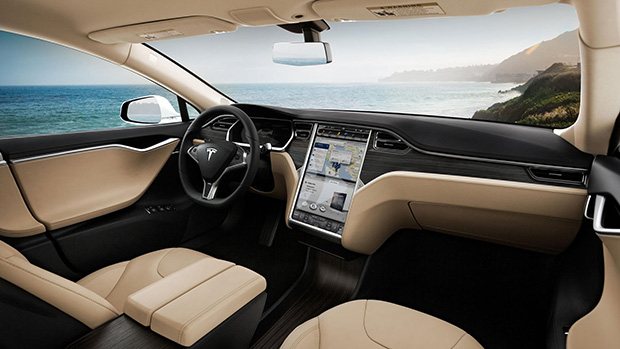
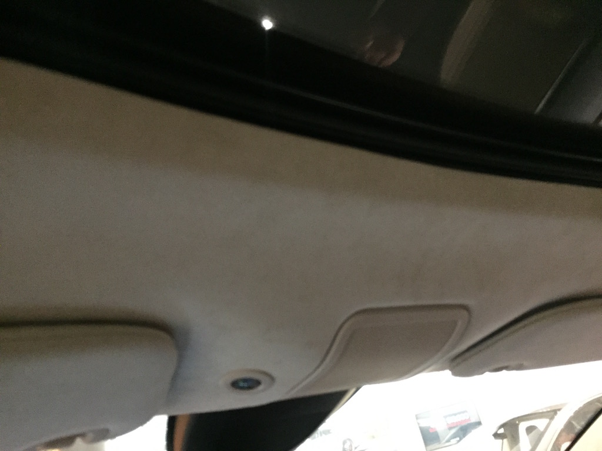
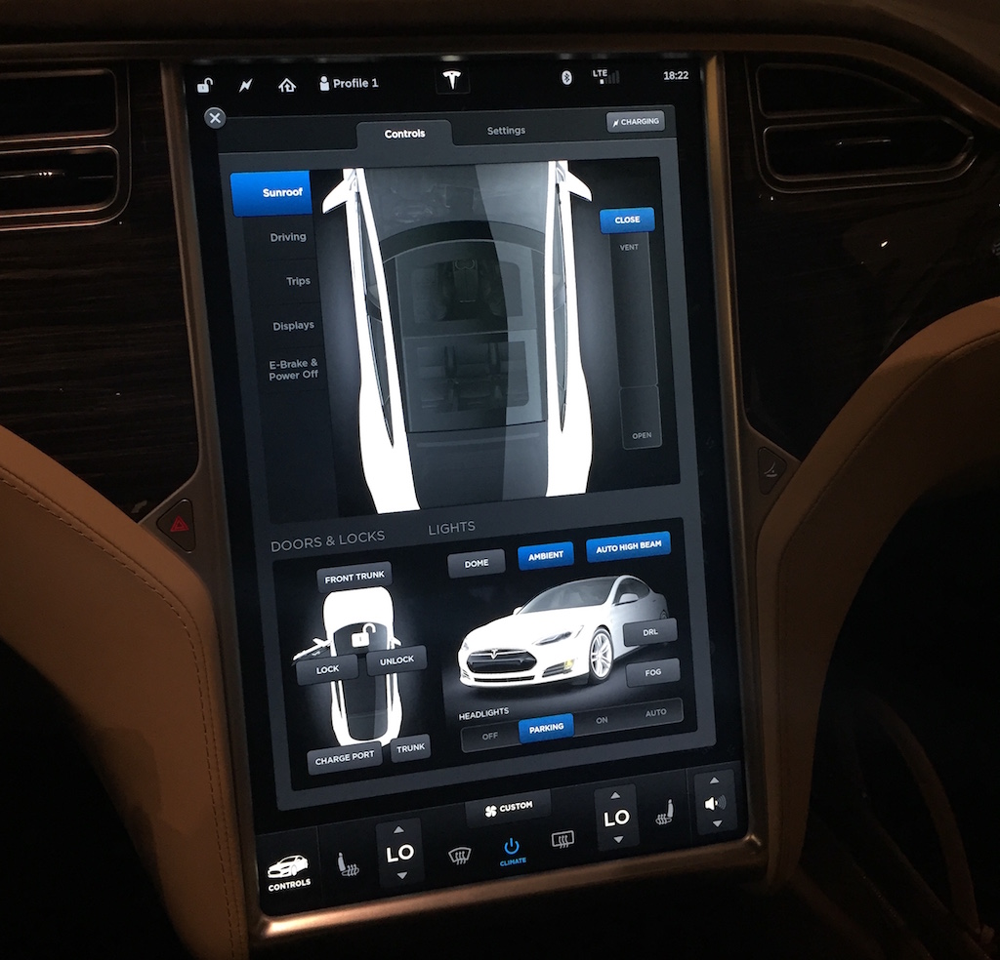
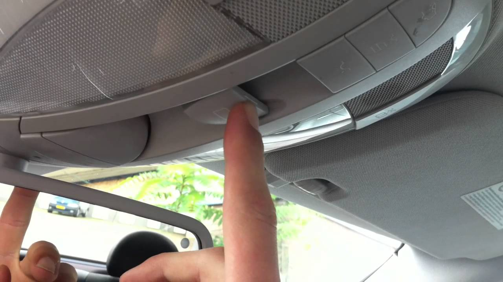
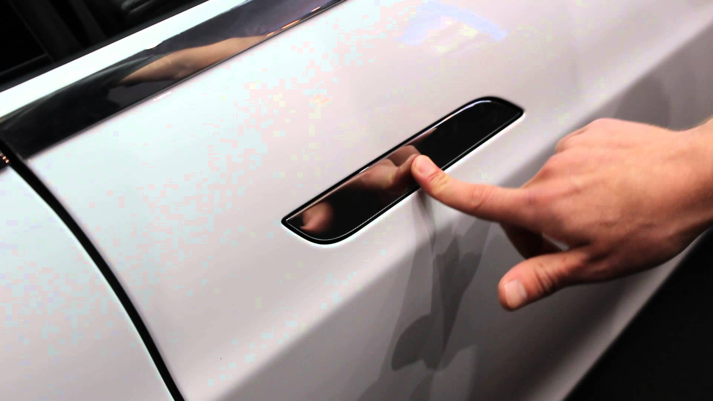
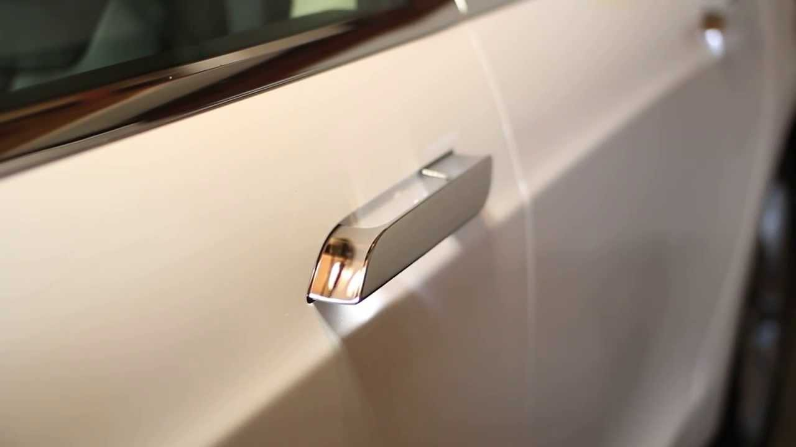
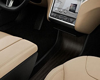
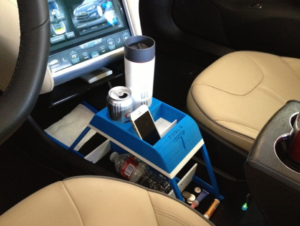
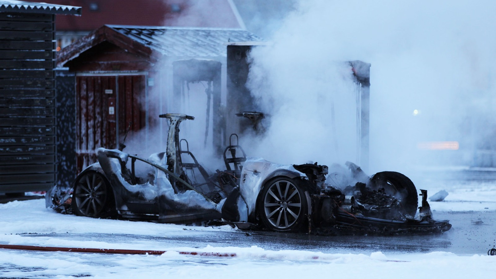
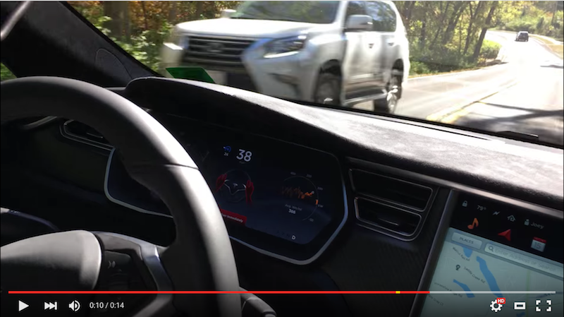

　　 

## Tesla Model S的设计失误

这幅美丽的图片，就是红极一时的Tesla电动车Model S的内景。然而你有没有发现，其中有一些不大对劲的地方？虽然我看好电动汽车，它们环保，安静，运动敏捷，然而我发现Tesla的这款Model S，其实有一些严重的设计失误。

### 缺少硬件开关，过度依赖软件和触摸屏

纵观Model S的内景，你会发现这车里面怎么光溜溜的，就没看到几个按钮。确实如此，Model S内部设施的控制，基本上完全靠中间那个很大的触摸屏。

顶棚上有一个天窗，却没看见天窗的开关。通常说来，当人们看见门或者窗户，他们期望有一个开关，设在旁边顺手的地方。然而你在Model S里面一抬头，却看不见任何可以按下或者掰动的开关。顶棚上面几乎是光溜溜的一片：

有些人可能觉得这样的设计，比其它车子更加美观，简洁。然而你可能没想到，这种“美观”其实是有代价的。一个很简单的问题是：你怎么打开天窗？答案：你必须使用触摸屏！

你要在触摸屏上找到一个叫“Controls”的页面，然后从左边的控制栏选择“Sunroof”，然后在右边会出现一个车子的图片，和一个滚动条。你把滚动条往下拉，天窗就打开了……

### 把简单的问题复杂化

然而这种依赖于触摸屏的设计，其实是让简单的问题变复杂，变麻烦了。其它车的天窗开关都是很明显，不需要“找”的，而Tesla的天窗开关，你要找一会儿，甚至找到了还要琢磨一下，才会知道该怎么用。我现在把导致这种结果的原因，详细分析如下：

  1. 天窗控制器不在天窗旁边。触摸屏跟天窗，处于风马不及的位置。这违反了一条基本的设计原理：控制器应该很容易找到，最好在它所控制的东西上面或者旁边。如果用户想打开天窗，他应该能够在天窗旁边，找到一个明显是用来打开它的开关。几乎所有其它车子，天窗开关都在顶棚上，不知Model S的设计者，为何要抛弃这种久经考验的设计。

  2. 触摸屏上干扰信息太多，不容易找到正确的按钮。触摸屏太大，上面显示着所有控制器的信息。这些控制器的位置，本来可以分布在车的各个部位，现在却集中到了一个仅十几寸的屏幕上面。这当然显示不下，只有放到好几个菜单里面去。

这些“软件控件”的位置，也不是很符合逻辑。例如，为什么有些控件（比如天窗）在tab里面藏着，而另外有些（比如门锁）直接露在外面？以至于你一眼看去，会不知所措。

相比之下，大部分其它车的硬件天窗控制器，附近没有很多干扰信息：

这个控制器在顶棚上，而且处于控制板的中央位置。旁边只有几个顶灯的开关。这些开关，对应着灯在顶棚上的位置。后面的灯，控制器在后面；前面的灯，控制器在前面；左边的灯，控制器在左边；右边的灯，控制器在右边……

这种排列方式，在设计学上叫做“自然映射”（natural mapping）。你不需要多次的摸索和记忆，甚至不需要看开关上的标记。只根据开关的相对位置，你就知道哪一个开关控制哪一盏灯。

  3. 查找天窗控制器的“逻辑路径”太深。从最开头的触摸屏界面，直到找到打开天窗的控件，你需要进入至少两层菜单。如果菜单之前停留在另外的状态，你还需要点击某个按钮，回到“主界面”，然后还要从上往下进入两级菜单。这种设计所需要的“逻辑路径”，长度>=3。

这种多层的“间接访问”，很容易把人搞糊涂。对年纪大点的人，几乎是不可用的。就算是年轻人，恐怕也需要摸索一阵子。如果在紧急情况下，或者事先没熟悉过这车的情况下，需要找到控制器（比如通过天窗逃生），恐怕会不知所措。

比较一下其它车子的设计吧。其它牌子车的顶棚上，一般有一个比较大的，明显是用来打开天窗的开关。不管车子当时处于什么状态，直接伸手就可以摸到这个开关。这种设计所需要的“逻辑路径”，长度=1，也就是说是直接的。

  4. 触屏的界面并不直观。仔细观察触屏上的控件，它们的操作方式并不是那么直观的。看到那个滚动条一样的东西，我该是点击呢，还是拖动呢？“VENT”，“OPEN”那几个字的位置，到底表示什么呢？我如何让天窗向上倾斜通风（tilt）？真是有点莫名其妙的感觉，恐怕要看说明书，摸索一会儿才能知道这到底怎么用。

相比之下，其它牌子汽车的硬件开关的设计，其实非常的直观。开关向后一拉，天窗就打开。向前一推，天窗就关闭。有些车子的天窗可以向上倾斜一定的角度（tilt），所以你可以把这按钮向上一推，天窗就进入倾斜通风的状态。

这种硬件开关的设计，符合了“自然映射”的原理。天窗的开关，成为了天窗的一个“模型”（model）。开关的位置，正好跟天窗平行。开关的运动方式，跟天窗的运动方式，产生一种“自然”的对应关系。开关向后，天窗也向后。开关向前，天窗也向前。开关被向上推，天窗也向上倾斜。这是非常好的设计。

### 触感，力反馈和行车安全

触摸屏缺乏触感和“力反馈”，无法进行“盲操作”。由于触摸屏是平的，所以它无法提供触觉和力反馈。你无法光靠手就摸到按钮的位置，而必须用眼睛看屏幕。当你找到并且拖动屏幕上的滚动条，你的手指不能得到任何力和振动的反馈。你不能立即感觉到，是否已经真的触发了“开天窗”这个操作。只有当天窗开始移动，你才知道刚才的操作是否成功。

相比之下，硬件天窗开关具有很大的优势。有些车子的天窗开关，设计得符合人体工学，正好符合你的手指的形状。摸起来容易，掰起来舒服，有感觉。手往上一摸，就能找到天窗控制器，之后不用眼睛就能操作。

像天窗开关这种“盲操作”，在开车的时候特别重要，因为开车时你的眼睛应该随时注视前方的道路。如果眼睛开小差去看屏幕了，就可能出车祸。这就跟开车时用手机发短信一样危险。触摸屏看起来很酷，而其实是降低了汽车的安全性。

### 系统可靠性：触摸屏是“中央薄弱环节”

仔细观察一下Model S，你会发现它的内部几乎没有硬件的开关。几乎所有的设施：天窗，空调气孔，窗户，门，后备箱，充电盖，…… 全都是用这个触摸屏来控制。

从系统设计的角度来看，这个触摸屏就是一个“中央薄弱环节”（single point of failure）。只要触摸屏一出问题，你就会失去对几乎所有设施的控制。根据这篇[文章](http://www.autonews.com/article/20140811/OEM06/140819992/tesla-model-s-has-more-than-its-share-of-problems-consumer-reports)，有的Tesla用户报告说，他的Model S在12000英里的时候，触摸屏突然坏掉，以至于门把都没法用了！

> Just before the car went in for its annual service, at a little over 12,000 miles, the center screen went blank, eliminating access to just about every function of the car…

相比之下，其它汽车的硬件开关位置是分散的，它们的电路逻辑是相对独立的。一个开关坏掉了，另外一个还可以用。其它车子的屏幕，一般只用来显示倒车摄像信息，以及音乐娱乐等无关紧要的东西。Tesla用这个屏幕来控制所有的配件，真的是发挥过度了。

### 门把的设计问题

Model S的门把设计也有问题。它的门把是电动的，而其它车的门把，都是机械的。在停止的状态，Model S的门把会自动缩回去，不露一点缝隙：

当你接近车子的时候，内部的电机会让门把伸出来，这样你就能拉开车门：

按照Tesla设计师的[思路](http://www.carbodydesign.com/2013/11/tesla-chief-designer-creating-a-car-from-the-ground-up)：“第一次接近这部车的时候，你首先接触到的是门把：这应该是一个印象深刻的经历。在你走近的同时，门把也伸出来——就好像是这车子想起了你……”

> As you approach the car for the first time, the first contact you have with the vehicle is through the door handle: it needs to be a memorable experience […] The idea of this door handles that protrudes from the car as you approach it – [it’s like] the car is already thinking for you.

多么诗情画意的场景，一部会想起你的车，一个朋友！可惜这美好的第一印象，是经不起现实考验的。等你买下这车，实际用起来的时候，问题就来了。首先，这个门把被人手抓握的部分，是扁平的形状。这种形状非常的不符合人体工学，捏起来会很不舒服，使不上劲。如果车门被冰冻住，或者门被撞变形了，或者有紧急情况需要很快的开门，这门把就会带来很大的麻烦，甚至可能是很危险的。

另外，在寒冷的地区，车停在外面，缩进去的门把会被冰冻住。等你要开门的时候，才发现门把被冻住了，出不来。如果软件出了故障，也可能导致门把出不来。一旦出了这些事情，你就完全失去了打开车门的能力。如果门把是机械的，就算上面有一点冰，一拉把手，冰就碎掉，门就开了。如果实在冻得严重了，你把冰稍微凿一下，一拉就开。Tesla的设计者，貌似完全没考虑过这些“意外”的情况。

没有任何其它牌子的汽车采用像这样的门把设计。从丰田一直到[Bugatti](http://www.bugatti.com)，它们的门把全都是机械的，粗壮的，直接就可以拉的。没人在这上面耍花样。你想这应该有原因的吧？由于人的生命安全，在事故的时候依赖于快速地打开车门，门把的设计需要是坚固而可靠的。

只有Tesla别出心裁，搞得门把完全缩进去，跟车门平齐，连个可以用力的地方都没有。门把和车门之间的缝隙很小，所以冻在里面的冰没法凿开。很多人发现这是个讨厌的问题。看看这篇[讨论](https://my.teslamotors.com/it_IT/forum/forums/those-door-handles)，你就会发现人们为了这个门把，费了多少脑筋，想出五花八门的解决方案：

  * 提前远程启动车子，让内部温度起来，化掉把手上的冰
  * 往门把上泼热水
  * 放热水袋放在门把上
  * 停车的时候在门把上贴一块透明胶，发现冻上了就把胶布撕掉
  * 用电吹风吹
  * ... ...

不管这些方式可不可行，有没有效果，你都可以看到，这门把的设计，其实带来了不必要的麻烦。这样的设计，除了看起来很“未来”几乎没有任何实用价值。买了辆酷车，活得可真累。

### 人体工学和舒适性问题

另外，我发现Model S的触摸屏，其实在一个很不舒服的位置。如果我靠在司机的座位上，我的手是无法顺利地碰到屏幕右边的。我必须启用我的腹肌，稍微坐起来一点，努力伸出右手，才能够得着那个位置。

如果触摸屏的位置稍微往下放一点，倾斜度降低一些，就会方便很多。另外，这个触摸屏真的不需要做那么大。

另外一个奇葩的地方是，触摸屏下方，座位之间，有一片很低的，光溜溜的平面，像个微型的保龄球球道……

这貌似是用来放随身物品的。然而这个空间，由于位置和形状的问题，恐怕不会得到有效的利用。由于平台位置太低，几乎到了地板上，如果往里面放置物品，拿起来会非常的不顺手，甚至需要弯腰下去，而且恐怕会被不小心踢翻。因为整个平面是光滑的，中间也没有挡板，车子加减速时，东西可能会到处乱跑。从美学角度看，这个区域的边界，跟触摸屏线条错位，感觉不流畅，不美观。

另外有用户[反映](https://my.teslamotors.com/it_CH/forum/forums/cup-holders-and-spilled-coffee)，Model S的咖啡杯座，被设置在一个很容易被手肘碰翻的位置。某些Tesla的“专家用户”对此的建议是，去买“防溅”的咖啡杯。有些聪明人甚至自己设计，并且用3D打印机山寨了一个架子来放咖啡：

我对此举动非常的无语。本来Tesla的设计师应该做好的东西，居然需要自己动手。很不可思议的是，这样不舒服的车，被叫做“豪华车”，价钱是其它牌子的两三倍……

### 可靠性问题

虽然这篇文章里面，我只想指出Model S的设计问题，它其实也有很多可靠性的问题。

最近的一些[报道](http://jalopnik.com/report-two-thirds-of-early-tesla-model-s-drivetrains-m-1747222846)指出，由于动力系统的问题，2/3以上的早期Model S，动力系统的寿命都不会超过6万英里。Consumer Reports也[报道](http://www.consumerreports.org/cars/tesla-reliability-doesnt-match-its-high-performance)，Model S的可靠性“低于平均水平”。报告指出，Model S存在各种质量问题：触摸屏崩溃，门把失灵，发动机故障，天窗漏水，各种部件嘎吱作响，等等。另外一篇Consumer Report的[文章](http://www.roadandtrack.com/new-cars/car-technology/news/a27094/consumer-reports-tesla-model-s-not-recommended-on-reliability)，对各种电动车的可靠性进行了排名，Model S名列倒数第一。

### 安全性问题

2016年1月1号，在挪威的一个Tesla充电站，有一台Model S在充电的时候，莫名其妙起火燃烧（见[新闻](http://www.extremetech.com/extreme/220237-tesla-model-s-catches-fire-at-supercharger-station-in-norway)和[视频](https://www.youtube.com/watch?v=CWXN7ni4FTc)）。由于着火的材料是锂金属，消防队无法用水控制火势，只能用泡沫覆盖隔离，等待烈火把车子完全融化。最后这台车被完全烧毁，幸好没有人员伤亡。事故起因正在调查之中。

Elon Musk对此事故的反应比较让人失望，他说：“美国每年有上万辆汽车起火事故，没有人报道。为什么Tesla的车一起火，媒体就争相报道？” 不好好调查和检讨起火的原因，反倒笑别人“一百步”，这种态度是不可取的。

其实媒体报道Tesla车起火，是有他们的原因的。汽油车着火，一般都是因为有人犯了严重的错误，导致严重的车祸，油箱破裂，又遇上火源或者重击。或者由于车体老化漏油，又碰上火源。而电动车起火，不需要有人犯错误，不需要有严重的车祸，莫名其妙就着火了。你有见过崭新的汽油车，在加油站加油，忽然自己着火吗？

这不是第一辆起火的Model S。世界上只有3万多辆Model S，却已经出现过4起[起火事件](https://www.youtube.com/watch?v=q0kjI08n4fg)。之前的一个Model S，半路上底部被硬物撞击。屏幕提示说，电池出了问题，请停车并且撤离。幸好车主按照电脑的指示做了，结果撤离不久之后，车就开始燃烧。如果车主没有停车撤离，后果是相当可怕的。这种对生命危险缺乏明确警示信号，其实也是一种严重的设计问题。

锂电池起火的原因很奇怪，[波音787客机](https://en.wikipedia.org/wiki/Boeing_787_Dreamliner_battery_problems)上，出现过多次锂电池起火事故，引起了很大的关注。最后分析原因在于：

  1. 日本GS Yuasa公司制造的电池存在缺陷。
  2. 波音工程师，没有考虑到worse case的电池故障。
  3. FAA，在认证过程中没有考虑到电池的危险性问题。

既然锂电池有这么蹊跷的潜在危险，Tesla的起火事件，当然也应该受到重视。这问题不像Elon Musk说的那么可靠，那么不值一提。

### Autopilot的事故责任问题

两个月前，Tesla通过“软件更新”，使Model S具有了初级的“自动驾驶”（autopilot）功能。这个功能可以让Model S自动地，沿着有“清晰边界线”的车道行驶，根据前后车辆的速度相应的加速和减速。

这貌似一个很新很酷的功能，咋一看跟Google的自动车有的一拼（其实差得天远）。然而在推出后不久，YouTube上出现了一些视频（[视频1](https://www.youtube.com/watch?v=MrwxEX8qOxA)，[视频2](https://www.youtube.com/watch?v=Lx3-epk_ztQ)，[视频3](https://www.youtube.com/watch?v=LJnYCEQwtHs)，[视频4](https://www.youtube.com/watch?v=rkZ-jhLxrVc)，[视频5](https://www.youtube.com/watch?v=mLOG1bw3vSM)）。它们显示，autopilot在某些情况下有可能进行错误的判断和操作，有些险些造成严重的迎面车祸。

特别是[视频1](https://www.youtube.com/watch?v=MrwxEX8qOxA)显示，在路面线条清晰，天气很好的路上，autopilot忽然向左转向迎面方向的车道，差点导致严重的对撞车祸。仔细观察autopilot转向之前的情况，是由于路面上有阳光投下来的树影。Autopilot误以为那是一个障碍物，所以把车转上了反方向的车道！

从这个简单的视频我们可以看出：

  1. Autopilot没有对图像进行基本的“阴影消除”，它不能区分阴影和障碍物。阳光强烈，阴影明显的时候，autopilot可能把阴影当成障碍物。阴影消除在计算机视觉已经研究挺多了，这说明Tesla有可能没有进行基础的计算机视觉研究。缺乏分辨阴影和障碍物的能力，这样的自动驾驶系统是完全不可接受的。

  2. 道路中间有明显的，表示“禁止超车”的双黄线，对面有来车。Autopilot为了避开“障碍”，冒着对撞的危险，左转跨越双黄线。这表示autopilot连基本的交通规则，紧急情况下的正确操作方式都搞不清楚。或者也许这软件里面连双黄线都没有识别，甚至连这个概念都没有。

对于一个有经验的驾驶员来说，如果发现前方有障碍物，正确的作法不应该是猛烈地转弯避开，而应该是紧急刹车。从视频上我们看出，车子没有刹车减速（保持在37~38），而是猛烈地左转。而且是等树影到了面前，才忽然进行操作，没有计算提前量。这说明设计autopilot的人，连基本的开车常识都不明白。

让我感到悲哀的是，这些视频的很多评论，大部分都在谩骂车主是傻逼：“这是车主自己的责任！”，“Autopilot只能在高速公路上使用”，“只能在车道上有明确的边界线的时候使用！”，“不能在有很多弯道的地方“，“只能在能够看见前方300米道路的地方使用”，“谁叫你不看说明书的！”…… Elon Musk也在一次[采访](https://www.youtube.com/watch?v=60-b09XsyqU)中明确的告诉记者：“如果用户因为使用autopilot而导致了车祸，是用户自己的责任！” 他反复地声明：“autopilot还处于beta版本……” 意思是，你们小心着用！

我对这些说法持不同的观点。首先，Tesla根本就不应该把一个处于"beta状态"的功能，自动推送到所有Model S的系统里面。实际上，像autopilot这种功能，关系到人的生命安全，根本就不应该有"beta版本"或者“测试版本”之说。Tesla把这样不成熟的系统，强制推送给用户，然后又说如果出了事故，用户负所有责任，这是一种推卸责任的做法。要知道，没有任何人愿意拿自己的生命给Tesla做“beta测试”。

另外，就算是用户没有仔细阅读autopilot的使用说明，在“不该”用它的地方（比如路面线条不清晰的地方）使用了autopilot，如果出了车祸，Tesla也应该负完全的责任。理由如下：

  1. 作为用户，他们没有义务阅读并且深刻的理解autopilot的局限性。在软件行业，存在一种习惯性的“责备用户”的不良风气。如果软件的设计有问题，用户没记住它的毛病，没能有效地绕过，那么如果出了问题，一般被认为是用户的错。Tesla想把软件行业的这种不正之风，引入到人命关天的汽车行业，那显然是行不通的。

  2. Tesla的autopilot实现方式幼稚，局限性实在太多。天气不好的时候不行，路面上的边界线不清晰也不行，光线不好或者有阴影不行，路上有施工的路桩不行，高速出口不行，…… 实际上，在如此苛刻的限定条件下，任何一个汽车厂商都可以做出Tesla那种autopilot。

我自己的便宜Honda车，就有偏离车道时发出警告的功能（Lane Drift Warning，LDW）。装个摄像头，来点最简单的图像处理就搞定。在Indiana大学的时候，我们有一门本科级别的课程，就是写代码控制一辆高尔夫球车（也是电动车呢），沿着路面上的线条自动行驶。这根本没什么难度，因为它能正确行驶的条件，实在是太苛刻了。

其它汽车厂商很清楚这种功能的局限性，所以他们没有大肆吹嘘这种“线检测”的技术，或者把它做成autopilot。他们只是把它作为辅助的，提示性的功能。这些汽车厂商理解，作为一个用户，他们不可能，也不应该记住autopilot能正确工作的种种前提条件。

  3. 用户没有足够的能力来“判断”autopilot正常工作的条件是否满足。比如，路上的线还在，但是被磨损了，颜色很浅，那么autopilot到底能不能用呢？谁也不知道。把判断这些条件是否满足的任务推给用户，就像是在要求用户帮Tesla的工程师debug代码。这显然是不可行的。如果autopilot能够在检测到道路条件不满足的情况下，自动警告用户，并且退出自动驾驶模式，那还稍微合理一些。

  4. 用户也许没有足够的时间来响应条件的改变。Autopilot自动驾驶的时候，车子有可能最初行驶在较好的条件下（天气好，路面线条清晰），然而随着高速行驶，路面条件有可能急速的变化。有可能上一秒还好好的，下一秒路面线条就不再清晰（[视频5](https://www.youtube.com/watch?v=mLOG1bw3vSM)貌似这种情况）。路面条件的变化突如其来，驾驶员没有料到。等他们反应过来，想关闭autopilot的时候，车祸已经发生了。这种情况如果上诉到法庭，稍微明理一点的法官，都应该判Tesla败诉。

  5. Autopilot显摆出的“高科技”形象，容易使人产生盲目的信任，以至于疏忽而出现车祸。既然叫做“autopilot”，这意味着它能够不需要人干预，自动驾驶一段时间。既然用户觉得它能自动驾驶，那么他们完全有理由在到达高速路口之前（比如GPS显示还有一个小时才到出口），做一些自己的事情：比如看看手机啊，看看书啊，甚至刷刷牙…… 不然，谁让你叫它是“autopilot”的呢？我坐飞机时，就见过飞行员打开autopilot，上厕所去了。如果启用了autopilot还得一秒钟不停地集中注意力，那恐怕比自己开车还累。自己开车只需要看路，现在有了autopilot，不但要看路，还要盯着方向盘，防止autopilot犯傻出错……

  6. Tesla把“beta版”的autopilot推送给所有的Model S，是对社会安全不负责任的做法。你要明白Murphy's Law：如果一个东西可能出问题，那么就一定会有人让它出问题。Autopilot的功能不成熟，限制条件很多，不容易被正确使用，这不但对Model S的车主自己，而且对其他人也是一种威胁。汽车不是玩具，随便做个新功能，beta版，让人来试用，是会玩出人命的。我觉得Tesla的autopilot，跟无照驾驶的人一样，应该被法律禁止。由于autopilot的复杂性和潜在的危险性，使用autopilot的用户，应该经过DMV考核，在驾照上注明“能正确使用Tesla autopilot”，才准上路。

  7. 关系到人的生命安全的“免责声明”和“用户协议”，在法律上是无效的。在美国，到处都存在“免责声明”之说。比如你去参加学校组织的春游活动，都要叫你签一个“waiver”，说如果出了安全事故或者意外，你不能把学校告上法庭。这种免责声明，一般在法律上都是无效的。如果由于学校的过错而致使你的身体受了损伤，就算你签了这种waiver，照样可以把学校告上法庭。我估计Tesla的autopilot在启动时，也有这样的免责声明，说如果使用autopolit而出现车祸，Tesla不负责任。由于autopilot直接操控了你的车子，如果真的出了车祸，这跟其它的waiver一样，都是无效的。你照样可以上法庭告他们。

由于意识到这个问题，知道出了问题自己是逃不掉责任的，Tesla最近又通过强制的软件更新，对autopilot的功能进行了一些[限制](http://www.reuters.com/article/us-tesla-autopilot-idUSKCN0UO0NM20160110)，说是为了防止用户“滥用”autopilot做一些“疯狂”的事情。Tesla很疯狂，反倒指责用户“滥用”和“疯狂”。这让人很愤慨。

对autopilot进行限制的同时，Tesla又推出了beta版的“[自动趴车](http://www.cnet.com/news/tesla-cars-can-now-self-park-at-your-command)”和“召唤”（summon）功能。这些功能貌似很酷，然而它们也附带了许多的限制条件。你只能在某些地方，满足某种特定条件，才能用这些功能。如果你违反这些条件，出了事故，Tesla声称不负责。

这些能够让车子自己移动的功能，跟autopilot一样，同样会给社会带来安全隐患。比如，有人在不该使用自动趴车和summon功能的地方用了它，就可能会导致车祸。这不是用户的问题，而是Tesla根本不应该发布这些不成熟的技术来哗众取巧。

### 对待设计的态度问题

我发现Tesla的设计团队，在态度上有一些严重的问题。Tesla的总设计师Franz von Holzhausen，在一个[采访](http://gigaom.com/2013/11/06/how-tesla-overcame-the-challenges-of-electric-car-design-from-the-ground-up)中谈到，Tesla是如何在“完全没有汽车设计经验”的背景之下，“从零开始”（from ground up）设计出了Model S，好像是非常了不起的成就似的。这位设计师提到：“Tesla是从一张白纸（clean slate）开始，没有已有的思想可以借鉴……”

这其实是而夸大其词。世界上没有任何成功的设计，真的可以从所谓“白纸”开始的，你总是有前人的经验可以学习。不管是前人的成功还是失败，都有借鉴的意义。电动车比起汽油车，其实并不是一个全新的领域，它只不过是动力系统不一样而已。像门，窗，内饰，轮子，减震器，方向盘之类，里面的设计原理，其实都是一样的。

仅仅因为动力不一样，就对前人的经验视而不见，甚至盲目的藐视。这样的态度给用户带来的，是潜在的麻烦甚至危险。有些人喜欢把一个领域说成是全新的，往往是因为他们想“圈地”。所以Tesla的设计师其实是在说，电动车这个领域跟其它汽车公司的都不一样，所以你们都不用跟我竞争啦。同时这也可以让用户以为，只有Tesla才能做出电动车。

另外，我觉得人们对Elon Musk的个人崇拜，导致了很多人对Tesla的问题视而不见，盲目的以为Tesla是好车，豪华车，是最先进的技术。很多人盲目的相信Elon Musk，以为他是天才，他说的，他做的都是对的，而其实并不是这样。有传言说，Model S最早的设计，很多是Elon Musk自作聪明提出来的。后来其中特别不堪的一些，被设计师给去掉了。然而这种盲目“创新”的传统，却在Tesla遗留下来，并且利用媒体向全世界辐射，给大家洗脑。

Tesla标榜自己重视“设计”，其实却歪曲了“设计”这个词的含义。喜欢谈论所谓“用户体验”（User Experience），然而他们所谓的用户体验，只是浮于表面。真正的用户体验，应该是在实质上方便，可靠，舒服，易用。而Tesla所谓的用户体验，强调的是一些肤浅的，没有实质意义的方面，比如让门把自动伸出来，让你感觉它是你的朋友。

Elon Musk甚至在一次[采访](http://www.cc.com/video-clips/o26y1r/the-colbert-report-elon-musk-pt--1)中提到，你应该能够给你的车子起个名字，它应该就像你的宠物一样。由此可见，他关心的是什么 :) 说实话，真的有人在乎一个车的门把吗？我怎么觉得他的vision或者价值观有问题。花费很大工夫，试图让你在买车之前产生良好的第一印象，以至于不惜重金。结果买下来之后的日子里，你就发现它的各种毛病——连最便宜的车都没有的毛病。

汽车的设计，很多方面关系到人的生命安全。车上的各种设备，为什么是那个形状，为什么在那个位置，很多都是有理由的。不是你想它是个什么样子，就可以是什么样子的。很多这些经验甚至可能是用生命换来的，经历了战火和各种恶劣环境的考验。这真的不是一个新的公司短短几年就可以摸索清楚的。

有些设计貌似很新，很酷，很未来，像科幻电影里面的一样。直到你开始用它，才发现是有问题的。很多人把Elon Musk比作[钢铁侠](http://www.imdb.com/title/tt0371746)，然而他们没有意识到，科幻和现实是有很大区别的。Elon Musk的背景（物理系PhD辍学），也许可以做出高性能的电动机，然而一辆汽车除了发动机，还有很多关键的方面。忘记历史就等于毁灭未来，标新立异，不吸取前人的经验教训，把好的东西学过来，这样做设计是很难成功的。
